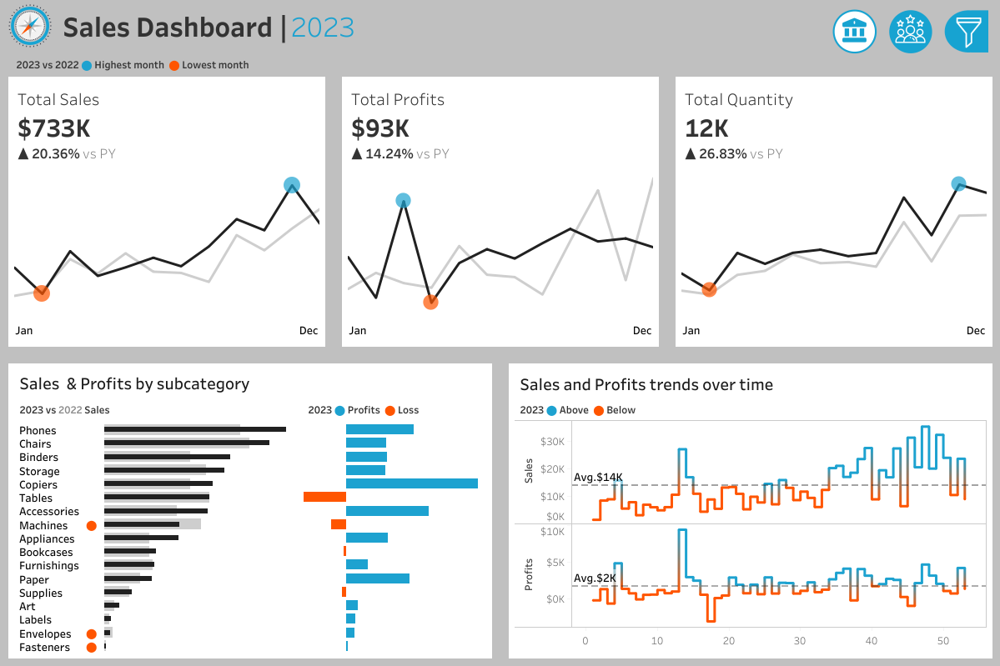
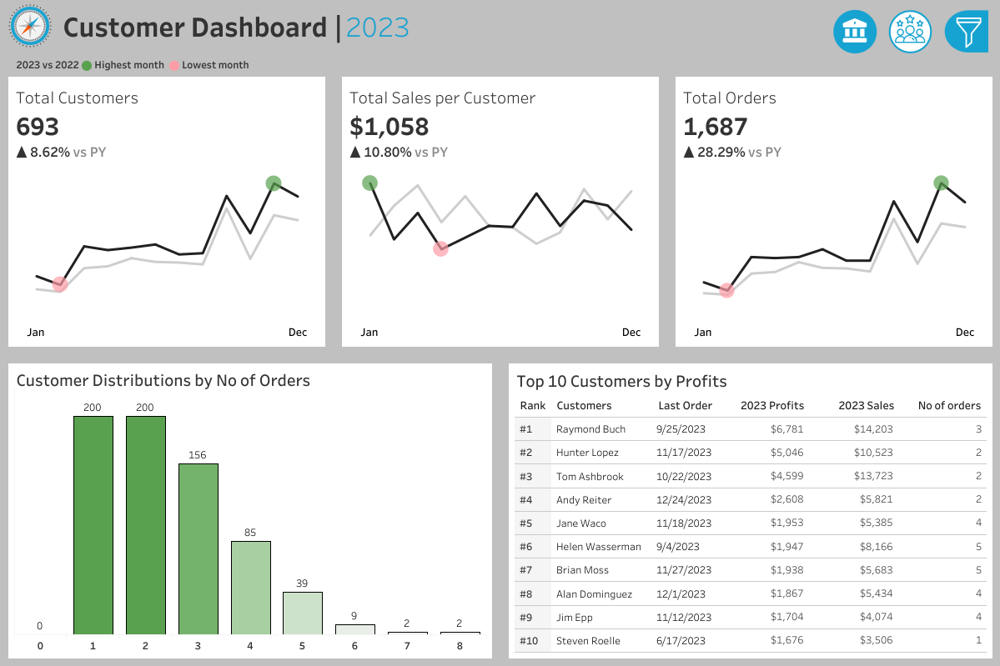

# Tableau Complete Project End-to-End(Tutorial Project)

Welcome to the **Tableau Complete Project End-to-End** repository!<br>
This project walks through the complete process of data analysis and visualization in Tableau, starting with requirements analysis and ending with fully built dashboards that answer real business questions. It introduces core Tableau functions and tools through the process of building charts and dashboards.

---
## ⚙️Project Workflow
The project workflow for the Tableau Complete Project follows these steps:


---
## 🗠Dashboard Preview


🔗 [View the interactive version on Tableau Public]([https://public.tableau.com/app/profile/yourname/viz/...](https://public.tableau.com/views/TableauCompleteProjectE2E-SalesDashboard/SalesDashboard?:language=en-US&publish=yes&:sid=&:redirect=auth&:display_count=n&:origin=viz_share_link)



🔗 [View the interactive version on Tableau Public]([https://public.tableau.com/app/profile/yourname/viz/...](https://public.tableau.com/views/TableauCompleteProjectE2E-CustomersDashboard/CustomerDashboard?:language=en-US&:sid=&:redirect=auth&:display_count=n&:origin=viz_share_link)

---
## 🔗Important Links & Tools:

- **[Datasets](datasets/sales-dashboard-project/datasets)**: Access to the project dataset(csv files).
- **[DrawIO](https://www.drawio.com/)**: Design data architecture, models, flows, and diagrams.
- **[Emojipedia](https://emojipedia.org/en)**: emoji and icon collections
- **[Git Repository](https://github.com/)**: Set up a GitHub account and repository to manage, version, and collaborate on your code efficiently.
- **[Notion](https://www.notion.com/templates/sql-data-warehouse-project)**: Get the Project Template from Notion
- **[SQL Server Express](https://www.microsoft.com/en-us/sql-server/sql-server-downloads)**: Lightweight server for hosting your SQL database.
- **[SQL Server Management Studio (SSMS)](https://learn.microsoft.com/en-us/sql/ssms/download-sql-server-management-studio-ssms?view=sql-server-ver16)**: GUI for managing and interacting with databases.
- **[Tableau Public](https://www.tableau.com/access/download/public)**: Tableau is a visual analytics platform transforming the way we use data to solve problems - empowering people and organizations to make the most of their data.

---

## Project Requirements

### 🔭Analyze Requirements

#### Choose the right charts<br>
For this project, the types of charts mostly used were 📈line charts and 📊bar charts.

#### Draw Mockup
Refer to pages 6 - 8 in [Dashboard Mockup Diagram](datasets/sales-dashboard-project/project_phases.pdf)

#### Dashboard Color Scheme

**Sales Dashboard**<br>
Below are the colors used in the Sales Dashboard:

| Purpose | Swatch | Hex Code |
|---------|--------|----------|
| Current Year   |  | `#212121` |
| Previous Year  |  | `#cecece` |
| Highest value, above average value |  | `#1da2d0` |
| Lowest value, below average value |  | `#ff5500` |

**Customers Dashboard**<br>
Below are the colors used in the Customers Dashboard:

| Purpose | Swatch | Hex Code |
|---------|--------|----------|
| Current Year   |  | `#212121` |
| Previous Year  |  | `#cecece` |
| Highest value, above average value |  | `#59a14f` |
| Lowest value, below average value |  | `#ff9da7` |
---

### Repository Structure
```


```

---

## License

This project is licensed under the [MIT LICENSE](LICENSE). You are free to use, modify, and share this project with proper attribution.

## About Me

Thanks for visiting! I'm **Mustafa**, an insurance operations professional on a mission to master data analytics and turn raw data into real insights.


[](https://linkedin.com/in/mustafa-muntak)
[](https://public.tableau.com/app/profile/mustafa.muntak)
