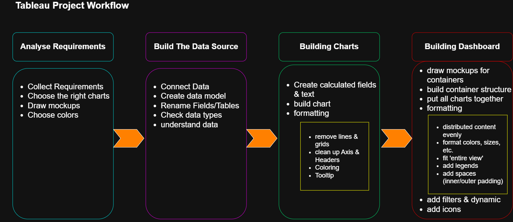

# Tableau Complete Project End-to-End(Tutorial Project)

Welcome to the **Tableau Complete Project End-to-End** repository!<br>
This project walks through the complete process of data analysis and visualization in Tableau, starting with requirements analysis and ending with fully built dashboards that answer real business questions. It introduces core Tableau functions and tools through the process of building charts and dashboards.

---
## ⚙️Data Architecture
The data architecture for this project follows these steps:



---
## 🔗Important Links & Tools:

- **[Datasets](datasets/sales-dashboard-project/datasets)**: Access to the project dataset(csv files).
- **[DrawIO](https://www.drawio.com/)**: Design data architecture, models, flows, and diagrams.
- **[Emojipedia](https://emojipedia.org/en)**: emoji and icon collections
- **[Git Repository](https://github.com/)**: Set up a GitHub account and repository to manage, version, and collaborate on your code efficiently.
- **[Notion](https://www.notion.com/templates/sql-data-warehouse-project)**: Get the Project Tempalte from Notion
- **[SQL Server Express](https://www.microsoft.com/en-us/sql-server/sql-server-downloads)**: Lightweight server for hosting your SQL database.
- **[SQL Server Management Studio (SSMS)](https://learn.microsoft.com/en-us/sql/ssms/download-sql-server-management-studio-ssms?view=sql-server-ver16)**: GUI for managing and interacting with databases.
- **[Tableau Public](https://www.tableau.com/access/download/public)**: Tableau is a visual analytics platform transforming the way we use data to solve problems - empowering people and organizations to make the most of their data.

---

## Project Requirements

### Analyze Requirements


---
### Repository Structure
```
data-warehouse-project/
│
├── datasets/                           # Raw datasets used for the project (ERP and CRM data)
│
├── docs/                               # Project documentation and architecture details
│   ├── analyse_source_systems.md       # Acquiring relevant information before performing data connections
│   ├── ETL Diagram.png                 # shows all different techniques and methods of ETL
│   ├── data_architecture.png           # shows the project's architecture
│   ├── integration_model.png           # shows how data are connected
│   ├── data_catalog.md                 # Catalog of datasets, including field descriptions and metadata
│   ├── data_flow_diagram.png           # data flow diagram
│   ├── data_mart.png                   # data models (star schema)
│   ├── naming_conventions.md           # Consistent naming guidelines for tables, columns, and files
│   ├── data_layers.pdf                 # A one-slide-deck reference guide explaining the Bronze/Silver/Gold medallion data architecture — covering each layer's purpose, workflow, and a source-system interview checklist for onboarding new data sources.
│
├── scripts/                            # SQL scripts for ETL and transformations
│   ├── bronze/                         # Scripts for extracting and loading raw data
│   ├── silver/                         # Scripts for cleaning and transforming data
│   ├── gold/                           # Scripts for creating analytical models
│
├── tests/                              # Test scripts and quality files
│
├── README.md                           # Project overview and instructions
├── LICENSE                             # License information for the repository

```

---

## License

This project is licensed under the [MIT LICENSE](LICENSE). You are free to use, modify, and share this project with proper attribution.

## About Me

Thanks for visiting! I'm **Mustafa**, an insurance operations professional on a mission to master data analytics and turn raw data into real insights.


[](https://linkedin.com/in/mustafa-muntak)
